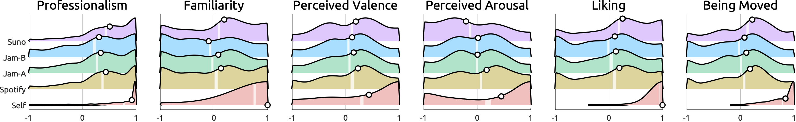
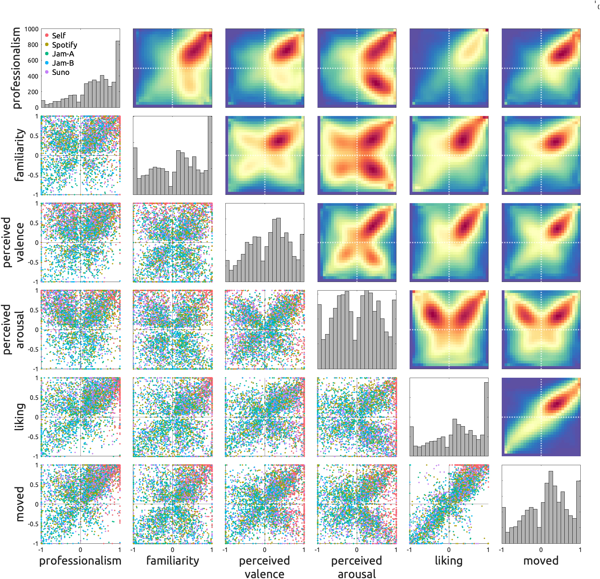
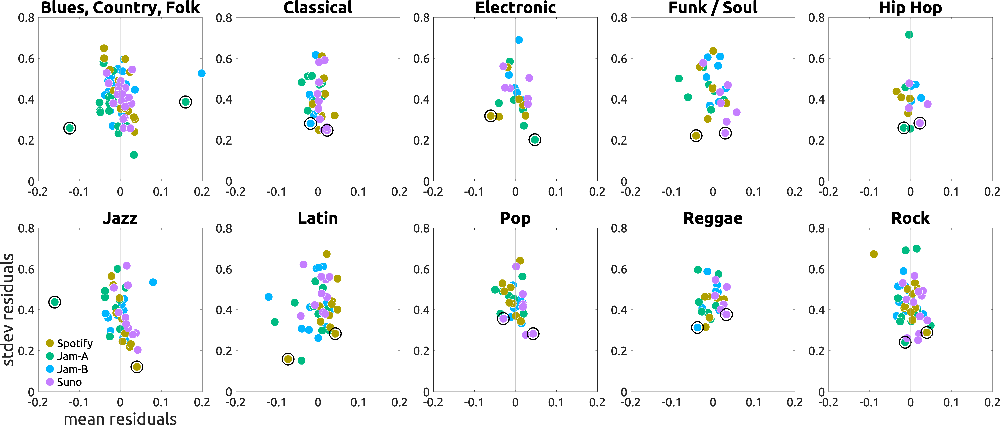

# Human validation

## Stimuli

### Proposed stimuli

#### Jamendo-A

#### Jamendo-B

### Control stimuli

#### Self-selected Apple Music previews

Only track IDs are provided.

#### Spotify previews

Only track IDs are provided. Audio files can be downloaded from the MusAV Dataset: https://zenodo.org/records/7448344

#### SUNO-v4.5

Audio files are included in the Zenodo repo.

## Procedure

An online experiment was conducted as follows.  
Participants first selected three of their favorite tracks using the [Apple MusicKit API](https://developer.apple.com/musickit/).
They then rated 30-second previews of the three self-selected tracks and 20 experimenter-selected tracks on six scales: `Professionalism`, `Familiarity`, `Perceived Valence`, `Perceived Arousal`, `Liking`, and `Being Moved`.

On average, experimenter-selected tracks were rated by 10.4 participants.

After the ratings, participants completed a series of questionnaires, including the Goldsmiths Musical Sophistication Index (Gold-MSI) and questions on preferred musical genres.  

All procedures were approved by the ethics committee of the Max Planck Society.

## Participants
Via an online experiment platform, [Prolific](https://www.prolific.com/), 233 participants completed the tasks.  
Participants were compensated at a rate of 9 GBP per hour.
After excluding those who displayed invalid behaviors, a total of 4,600 ratings from 190 unique participants were analyzed.  
The modal age was 21 years, with a range from 18 to 40.
The sample consisted of 69\% males, 73\% white individuals, 88\% born in the US or UK, and 93\% residing in the US or UK.  
At least two years of musical experience was required for participation.  
The modal percentiles of the Gold-MSI subscales were 79\% for Musical Training and 75\% for Musical Emotions.

## Results

### Distribution of ratings

### Linear mixed-effects models

`rating ~ age + sex + gmsiEmotion + gmsiTraining + (1 + isThisExpMyGenre | subjectId) + (1 | trackId)`

### Association between scales

### Cross-subject reliability of ratings

