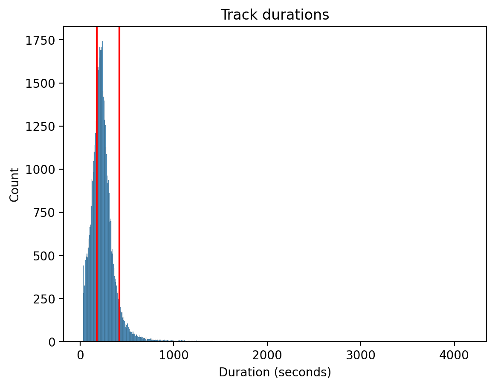
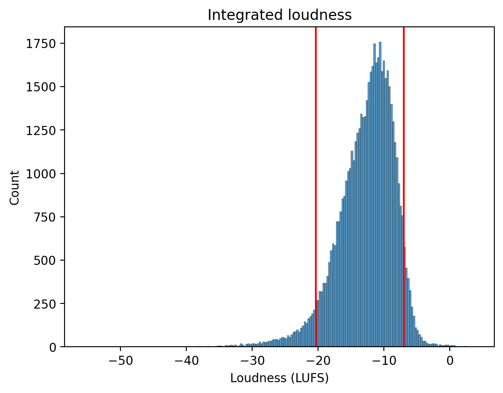
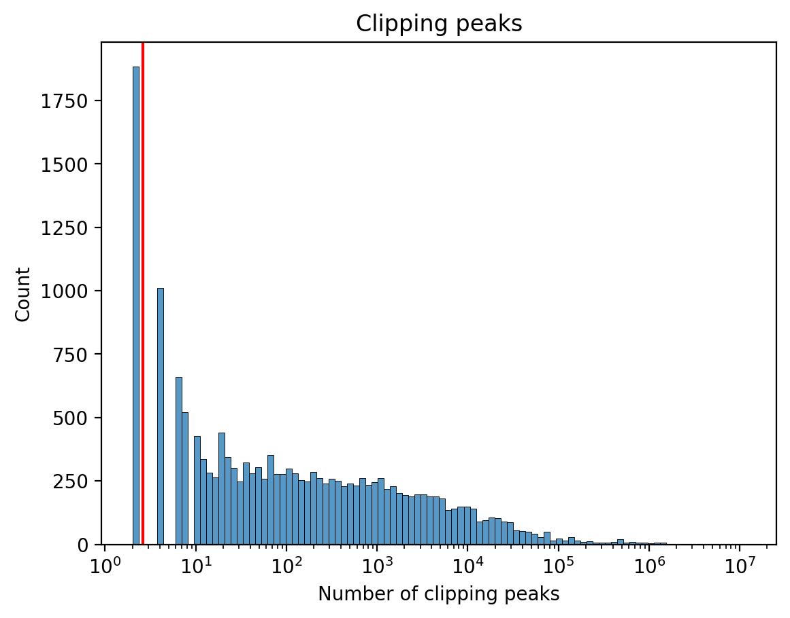

# Music curation

Our proposed dataset, *ManyMusic*, is built upon the MTG-Jamendo Dataset due to its availability under permissive licenses ([CC0](https://creativecommons.org/public-domain/cc0/) or [CC-BY-SA](https://creativecommons.org/licenses/by-sa/4.0/)), content quality (aiming for licensed, royalty-free music suitable for commercial use), and scale (over 55,094 full tracks in 320 kbps MP3 format).

The dataset creation process is divided into three stages (further details available in our data [repository](https://github.com/manymusic/manymusic-mtg-jamendo-stim-scripts)).

## Algorithmic filtering

We discard potentially problematic tracks based on audio analysis and the existing metadata. We exclude tracks based on the following criteria.

### Duration

We exclude tracks with a duration shorter than 3 minutes or longer than 7 minutes, resulting in 16,883 tracks being excluded.

 <small>**Track duration histogram.**  The red lines represent the 3 and 7 minute thresholds.</small>

### Integrated loudness

We discard tracks with excessively low or high loudness.
Since there are no established loudness limits in music, we set the thresholds at the 5th and 95th percentiles of the loudness distribution, corresponding to -20.3 LUFS and -7.0 LUFS, respectively.

 <small>**Integrated loudness histogram.** The red lines represent the 5th and -95th percentiles of the loudness distribution.</small>

### False stereo

We discard tracks in stereo format with a channel correlation higher than 0.9995, which are likely to be false stereo (i.e., mono tracks duplicated in both channels). This led to the exclusion of 2 tracks.

### Clipped samples

Audio clipping occurs when the amplitude of an audio signal exceeds the maximum limit that can be accurately represented, resulting in distortion.
Since audio clipping should not occur in professionally produced music, we exclude tracks above the 90th percentile of most clipped samples per track (5505 samples).

 <small>**Clipped samples histogram.** The red line represents the 90th percentile of the distribution.</small>

### Genre Activation threshold

We empirically observed that tracks with a pronounced amateur production quality tend to produce very low genre activations on the DiscogsEffnet genre classifier trained mostly on professionally produced music [[Alonso et al., 2022](https://doi.org/10.5281/zenodo.7316789)].
Thus, we exclude tracks with genre activations lower than 0.1 for all genre classes.
This resulted in 25,680 tracks being excluded.

### Denylisted tags

We discard tracks associated with MTG-Jamendo tags and predictions by the DiscogsEffnet model (activations >= 0.1).

|Tag| Source | Discarded tracks |
| --------------- | --------------- | --------------- |
| `xmas`, `christmas`, `advertising`, `presentation`, `background`, `backgrounds`, `corporate`, `commercial`, `motivations` | MTG-Jamendo tags | 2684 |
| `Non-Music`, `Chiptune`[^2]| DiscogsEffnet prediction | 1417 |

### Results

The process resulted in a subset of 24,903 out of 55,094 tracks (45.2%).

## Sampling based on genre and affect prediction

To achieve uniform genre distribution in the resulting dataset, we created genre subsets containing tracks with activation higher than 0.1 for the 12 genres predicted by the DiscogsEffnet model.

For each genre subset, we predicted Arousal and Valence (AV) activations using Essentia’s EmoMusic regression model based on MusiCNN [[Bogdanov et al., 2022](https://doi.org/10.5281/zenodo.7316746)], which produces embeddings with a rate of 0.33 Hz.
Then, we computed 3 k-means clusters, relying on dynamic time warping to normalize the duration of the embeddings. For each centroid, we sampled the 170 nearest neighbors, resulting in a total of 2,559 tracks, referred to as *Jamendo-A*.

## Human curation

We conducted a human curation process to discard problematic tracks with 19 annotators, including authors and colleagues, 90% of whom had experience in music performance, producing, and/or composition.
Our pool of 2,559 candidate tracks was divided into 13 chunks of 200 tracks, each of which received categorical ratings from three annotators (on average, one annotator rated 410 tracks).
The chunks were assigned so that no chunk was rated by the same set of three annotators.

For the annotation process, we developed an interface that plays a loudness-normalized audio track and provides navigation capabilities.[^3]
Each annotator was asked to choose only one from the following options to the best of their knowledge: `All Good`, `Bad Audio`, `Not Emotionally Conveying`, `Explicit Content`, `Copyrighted Content`, or `Not Good for Other Reasons`.

Hereafter, the set of tracks that received `All Good` from all three annotators is referred to as *Jamendo-B* (N = 1,129 out of 2,559; 44.1%).

[^2]: This was to avoid over-representation of this subgenre within Electronics.
[^3]: We used [wavesurfer.js](https://wavesurfer-js.org/) for waveform visualization and playback.

